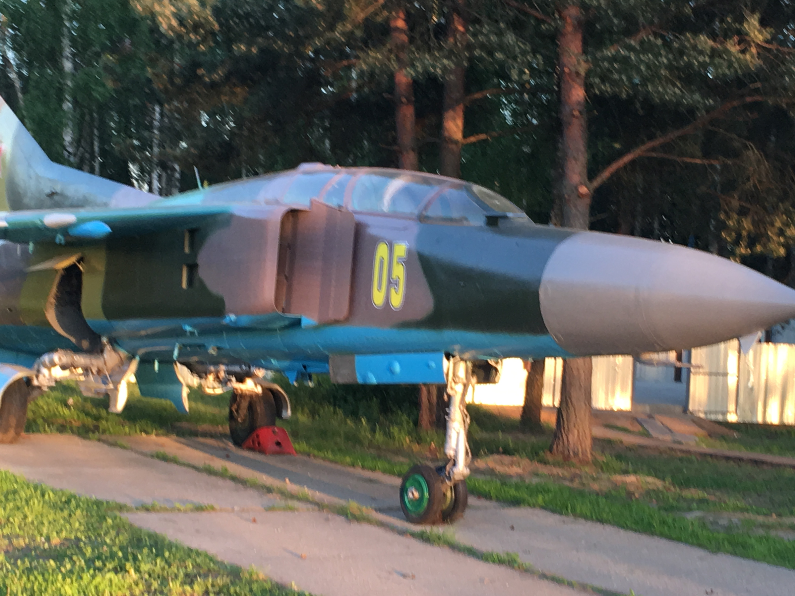
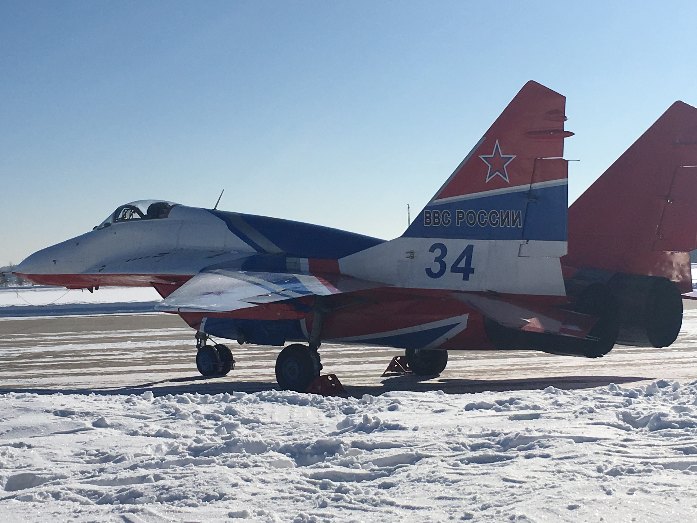

# trojan image  
   

:~/python/trojan$ python3 getGPS.py  
Enter the path to the image: archive/image.jpg  
[+] Extracting basic metadata...  
  
[Basic Image Information]  
Image Format: JPEG  
Image Size: (4032, 3024) pixels  
Image Mode: RGB  
  
  
[+] Extracting EXIF metadata...  
[EXIF Metadata]  
Image Make: Apple  
Image Model: iPhone SE  
Image DateTime: 2018:05:26 20:20:27  
EXIF FNumber: 11/5  
EXIF ExposureTime: 1/100  
EXIF ISOSpeedRatings: 40  
EXIF FocalLength: 83/20  
EXIF LensModel: iPhone SE back camera 4.15mm f/2.2  
  
[GPS Information]  
Latitude: 55.616919°  
Longitude: 36.667703°  

  
    
python3 getGPS.py  
Enter the path to the image: archive/image1.jpg  
[+] Extracting basic metadata...  
  
[Basic Image Information]  
Image Format: JPEG  
Image Size: (4032, 3024) pixels  
Image Mode: RGB  
  
  
[+] Extracting EXIF metadata...  
[EXIF Metadata]  
Image Make: Apple  
Image Model: iPhone SE  
Image DateTime: 2018:02:23 12:16:04  
EXIF FNumber: 11/5  
EXIF ExposureTime: 1/8547  
EXIF ISOSpeedRatings: 25  
EXIF FocalLength: 83/20  
EXIF LensModel: iPhone SE back camera 4.15mm f/2.2  
  
[GPS Information]  
Latitude: 55.607883°  
Longitude: 36.631947°  

  
 